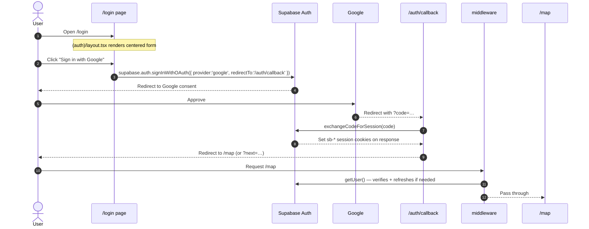

# Auth Flow

How a user transitions from anonymous to authenticated. Covers Google OAuth (primary) and email/password.

## Trigger

User opens any protected path while unauthenticated, or clicks "Sign in" / "Sign up" deliberately.

## Steps (Google OAuth)

## Steps (email/password)

Same path from step 5 onward. Steps 1–4 replaced by:

- `supabase.auth.signInWithPassword({ email, password })` (existing user) or
- `supabase.auth.signUp({ email, password })` (new user — triggers email confirmation if enabled in Supabase dashboard).

## Inputs / outputs

| Step | Input | Output / persisted state |
|---|---|---|
| OAuth redirect | provider choice | Google session (temporary) |
| Callback | `code` query param | `sb-access-token`, `sb-refresh-token` cookies on the response |
| First-time signup | OAuth claims (`full_name`, `avatar_url`) | `auth.users` row → triggers `handle_new_user` → `profiles` row → triggers `create_default_categories` → 12 category rows |
| Middleware on next request | request cookies | refreshed cookies, redirect decision |

## Public route table (middleware exempt)

- `/`
- `/auth/callback/*`
- `/shared/*`
- `/api/shared/*`

Plus `/login`, `/signup` are "auth routes" — accessible while unauthenticated, redirect to `/map` if authenticated.

Everything else requires auth. See [[../02-backend/auth#middleware-gate]].

## Failure modes

| Step | Failure | Surfaces as |
|---|---|---|
| OAuth redirect | User cancels | Returns to `/login` (Google handles the back) |
| Code exchange | Invalid / expired code | Redirect to `/login?error=auth_failed` |
| Code exchange | Mismatched redirect URI | Same. Fix in Supabase Auth → Providers → Google. |
| Email confirmation | User hasn't clicked the link | `signInWithPassword` returns "Email not confirmed" |
| Session refresh | Refresh token revoked | Middleware redirects to `/login` |
| Cookie write | Wrong domain config | Cookies don't stick → user keeps getting bounced to `/login` |

## Logout

`AppHeader` → user menu → "Sign out" → `supabase.auth.signOut()`. Clears cookies; next request redirects to `/login`.

## Related code

- `src/middleware.ts` — Next.js middleware entry.
- `src/lib/supabase/middleware.ts` — `updateSession` (refresh + redirect).
- `src/app/auth/callback/route.ts` — OAuth code exchange.
- `src/app/(auth)/layout.tsx` — pre-auth layout.
- `src/app/(auth)/login/page.tsx` — login form (Google button + email/password).
- `src/app/(auth)/signup/page.tsx` — signup form.
- `src/components/layout/app-header.tsx` — sign-out button.
- `src/lib/supabase/client.ts`, `server.ts` — clients used after auth lands.

## Open questions

- **`next` param.** `/auth/callback?next=/some/path` — confirm same-origin validation so it can't be used for open-redirect attacks.
- **Email confirmation.** Verify in Supabase Auth dashboard whether confirmation is required for email/password signups, and document the exact path the user sees.
